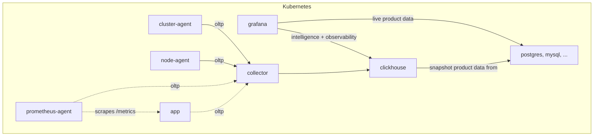
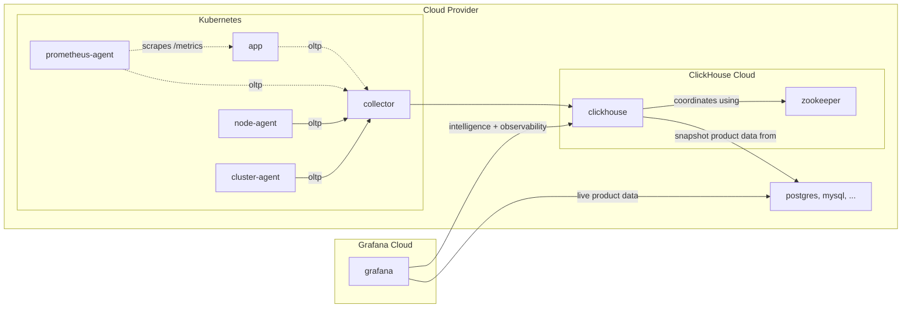

# Architecture

For a diagram illustrating a high level picture of the ecosystem, take a look at the [Overview](#overview) diagram.

## Technologies

<!-- COMMON BADGES -->

[License - Apache 2.0]: https://img.shields.io/badge/license-Apache_2.0-027FFF?style=for-the-badge
[License - AGPL 3.0]: https://img.shields.io/badge/license-AGPL_3.0-027FFF?style=for-the-badge
[Host - On-prem]: https://img.shields.io/badge/host-on_prem-FF0000?style=for-the-badge
[Host - Cloud]: https://img.shields.io/badge/host-cloud-FF0000?style=for-the-badge
[Role - Storage]: https://img.shields.io/badge/role-storage-yellow?style=for-the-badge
[Role - Instrumentation]: https://img.shields.io/badge/role-instrumentation-yellow?style=for-the-badge
[Role - Visualization]: https://img.shields.io/badge/role-visualization-yellow?style=for-the-badge
[Role - Alerting]: https://img.shields.io/badge/role-alerting-yellow?style=for-the-badge

### ClickHouse

![License - Apache 2.0][]
![Role - Storage][]
![Host - On-prem][]
![Host - Cloud][]

> ClickHouse is the fastest and most resource efficient open-source database for real-time apps and analytics.
>
> https://clickhouse.com/

ClickHouse provides our data warehouse layer. It stores logs, metrics, traces, as well as other business related data
sets. ClickHouse also comes with tons of integrations which makes it easy to source data from a variety of locations.

- System that's very reminiscent of one that I've used at a past [employer](https://www.youtube.com/watch?v=LBDZFtqL-ck).
- Easily import data from existing databases, object stores, queues, and many more [integrations](https://clickhouse.com/docs/en/integrations).
- Cloud option for those who don't want to run the system themselves.
- High availability requires deployment of a [Zookeeper ensemble](https://zookeeper.apache.org/doc/r3.1.2/zookeeperAdmin.html).
- Easily build data-enrichment pipelines using existing data in the system.

 

### OpenTelemetry

![License - Apache 2.0][]
![Role - Instrumentation][]
![Host - On-prem][]

> OpenTelemetry is a collection of APIs, SDKs, and tools. Use it to instrument, generate, collect, and export telemetry
> data (metrics, logs, and traces) to help you analyze your software’s performance and behavior.
>
> https://opentelemetry.io/

OpenTelemetry provides instrumentation for our ecosystem. Information is collected from a variety of sources using
vendor neutral solutions. The community also supports a large number of languages, making it easy to add to many systems
today.

- Supports a large number of [languages](https://opentelemetry.io/docs/languages/).
- [Collectors](https://opentelemetry.io/docs/collector/) provide a vendor-agnostic way to receive, process, and export
  telemetry data.
- [Exporters](https://opentelemetry.io/docs/collector/configuration/#exporters) allow data to be sent to a variety of
  backend destinations.
- [OTLP](https://opentelemetry.io/docs/specs/otlp/) provides a common and consistent way to collect metrics and traces
  across languages.

 

### Grafana

![License - AGPL 3.0][]
![Role - Visualization][]
![Role - Alerting][]
![Host - On-prem][]
![Host - Cloud][]

> Query, visualize, alert on, and understand your data no matter where it’s stored. With Grafana you can create,
> explore, and share all of your data through beautiful, flexible dashboards.
>
> https://grafana.com/oss/grafana/

Grafana provides our data exploration, visualization, and alerting layer. It can easily integrate with on-call solutions
like PagerDuty, OpsGenie, BetterStack, and many more.

- User-friendly query builders that allow non-technical staff to access information.
- Easily connects to popular relational databases with ease.
- Integrates nicely with Clickhouse, providing a single pane of glass to all your data.
- Unified alerting and notification channels makes it easy to get updated on what's happening with your product.
- Integrates with PagerDuty, BetterStack, and many others on-call solutions.
- Cloud hosted solution available for those who don't want to run the system themselves.

## Views

**Actors**

Some actors within the system are fairly self-explanatory (`grafana` and `clickhouse`), so I will focus on the less
obvious ones.

- `cluster-agent` runs and connects to the control plane of your cluster to get statitics about its operation and ingest
  it into the storage layer. Under the hood, this is an OpenTelemetry collector configured specifically for the control
  plane.
- `node-agent` runs on every node in your cluster and is responsible for collecting information from the node directly.
  This includes, but is not limited to, logs, kubelet metrics, and CNI provider metrics. Under the hood, this is an
  OpenTelemetry collector configured specifically for the nodes within a cluster.
- `prometheus-agent` is currently not yet implemented, but the idea is to have it watch processes for common prometheus
  labels / annotations that indicate metrics should be scraped from the instance. This could be configured and deployed
  a number of different ways. Under the hood, this is an OpenTelemetry collector configured specifically for scraping
  metrics from prometheus endpoints.
- `collector` represents an OpenTelemetry collector that's specifically setup to buffer and store data in ClickHouse. It
  acts as a gateway to the underlying data warehouse layer. Under the hood, this is an OpenTelemetry collector that has
  receivers enabled for OLTP over HTTP and gRPC.
- `postgres, mysql, ...` represents an arbitrary database. ClickHouse supports connecting to many popular database
  technologies so pulling in regular snapshots of tables is fairly easy to do.

### Overview

This illustrates the high-level communication pattern between the various actors within the system.

### Cloud-hosted

For those who prefer cloud-hosted solutions, both Grafana and ClickHouse offer a cloud-hosted version of their system.

