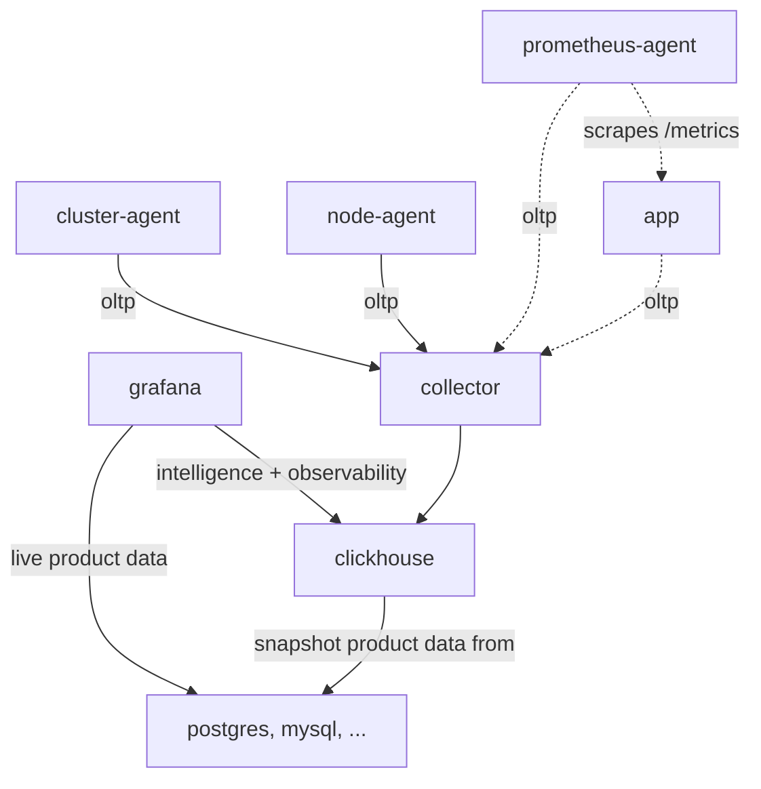
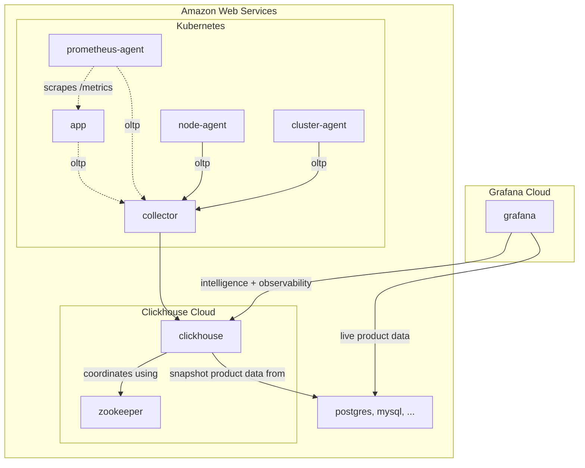

<div align="center">

[![Documentation][]](#overview)
[![Join the discussion!][]](https://github.com/mjpitz/cognative/discussions)
[![Developers guide][]](DEVELOPING.md)

[Documentation]: https://img.shields.io/badge/documentation-gray?style=for-the-badge
[Join the discussion!]: https://img.shields.io/badge/join_the_discussion!-blueviolet?style=for-the-badge
[Developers guide]: https://img.shields.io/badge/developers_guide-blue?style=for-the-badge

</div>

# cognative

cognative is an opinionated, minimalistic approach to business intelligence and operations.

**Goals**

1. Reduce the complexity and number of systems operations staff is required to have expertise on.
2. Maximize the breath of functionality they are able to support across business intelligence and operations.
3. Simplify the experience for developers.
4. Enable companies to own their own data.
5. Be flexible enough to support a variety of deployment models.

## Background

I started cognative as a recent reflection on the operational constraints faced by smaller organizations and how to
make best use of their skills and expertise. Requiring operations staff to be experts on a large number of systems
is not sustainable and will only lead to burn out. And yet, an increasing number of complex systems need to be run to
support business intelligence and operations.

The project name is a clever play on words. It takes the acronym for the tech stack (COG) and joins it with "native".
It came out of a discussion I had with [Tim Banks](https://github.com/timbanks) about the pitfalls of "traditional"
operations tech stacks and how it's often short-sighted once you start to consider the broader needs of business
intelligence. COG stands for **C**lickhouse, **O**penTelemetry, and **G**rafana.

- [_Clickhouse_](#clickhouse) is our data warehouse layer. It stores logs, metrics, traces, as well as other business
  related data sets. Clickhouse also comes with tons of integrations which makes it easy to source data from a variety
  of locations.
- [_OpenTelemetry_](#opentelemetry) provides instrumentation for our ecosystem. Information is collected from a variety
  of sources using vendor neutral solutions. The community also supports a large number of languages, making it easy to
  add to many systems today.
- [_Grafana_](#grafana) provides our data exploration, visualization, and alerting layer. It can easily integrate with
  on-call solutions like PagerDuty, OpsGenie, BetterStack, and many more.

### Scope of Work

[LGTM]: #lgtmp---loki-grafana-tempo-mimir--prometheus

Beyond proposing the initial proof of concept, my hope is to develop a lot of supporting resources to make this solution
as drop in as possible. Companies of varying sizes should be able to Solutions like [LGTM][] benefit heavily from
having many prebuilt resources (like dashboards and alerts) out of box.

- Examples
  - [ ] Clients emitting data
  - [ ] Stream processing pipelines
- Deployment
  - [x] Docker
    - Primarily for development and to show the proof of concept. Not suitable for production.
  - [x] Helm
    - Capabilities
      - [x] Collector that insulates write access to clickhouse.
      - [x] Cluster agent that collects control plane statistics.
      - [x] Node agent that collects host level statistics.
      - [x] Grafana preconfigured with a connection to clickhouse.
    - Charts
      - [x] [`cognative-standalone`](charts/cognative-standalone) offers a simpler variant. Instead of worrying about
            a clustered Clickhouse and Zookeeper cluster, it opts for a single instance deployment. This chart also offers
            companies a simpler way to trial the platform.
      - [x] [`cognative-bitnami`](charts/cognative-bitnami) offers an early version of the platform using prebuilt
            charts as dependencies. It's named for the provider of the storage tier, Bitnami. While it currently works, I
            have noticed some invariants with its current behavior.
- Operations
  - [ ] Dashboards & Alerting
    - [ ] Use [kubernetes-monitoring/kubernetes-mixin][] as a starting point...
    - [ ] JSONNET works, but it's not great
  - [ ] Playbooks
    - [ ] Common playbooks that can be used for resolving issues in production.

[kubernetes-monitoring/kubernetes-mixin]: https://github.com/kubernetes-monitoring/kubernetes-mixin

## Overview

<!-- todo: this section really is just a collection of notes for now... I need to pull it together better -->

- [Background](#background)
  - [Scope of work](#scope-of-work)
- [Overview](#overview)
- [Technologies](#technologies)
  - [Clickhouse](#clickhouse)
  - [OpenTelemetry](#opentelemetry)
  - [Grafana](#grafana)
- [Architecture](#architecture)
  - [Self-hosted](#self-hosted)
  - [Cloud-hosted](#cloud-hosted)
- [Alternatives](#alternatives)
  - [ELK - ElasticSearch, LogStash, Kibana](#elk---elasticsearch-logstash-kibana)
  - [LGTM/P - Loki, Grafana, Tempo, Mimir / Prometheus](#lgtmp---loki-grafana-tempo-mimir--prometheus)
  - [XOG - ?, OpenTelemetry, Grafana](#xog----opentelemetry-grafana)
- [License](LICENSE)

## Technologies

<!-- COMMON BADGES -->

[License - Apache 2.0]: https://img.shields.io/badge/license-Apache_2.0-blueviolet?style=for-the-badge
[License - AGPL 3.0]: https://img.shields.io/badge/license-AGPL_3.0-blueviolet?style=for-the-badge
[Host - On-prem]: https://img.shields.io/badge/host-on_prem-yellow?style=for-the-badge
[Host - Cloud]: https://img.shields.io/badge/host-cloud-yellow?style=for-the-badge
[Role - Storage]: https://img.shields.io/badge/role-storage-blue?style=for-the-badge
[Role - Instrumentation]: https://img.shields.io/badge/role-instrumentation-blue?style=for-the-badge
[Role - Visualization]: https://img.shields.io/badge/role-visualization-blue?style=for-the-badge
[Role - Alerting]: https://img.shields.io/badge/role-alerting-blue?style=for-the-badge

### Clickhouse

> ClickHouse is the fastest and most resource efficient open-source database for real-time apps and analytics.
>
> https://clickhouse.com/

![License - Apache 2.0][]
![Role - Storage][]

![Host - On-prem][]
![Host - Cloud][]

- System that's very reminiscent of one that I've used at a past [employer](https://www.youtube.com/watch?v=LBDZFtqL-ck).
- Easily import data from existing databases, object stores, queues, and many more [integrations](https://clickhouse.com/docs/en/integrations).
- Cloud option for those who don't want to run the system themselves.
- High availability requires deployment of a [Zookeeper ensemble](https://zookeeper.apache.org/doc/r3.1.2/zookeeperAdmin.html).
- Easily build data-enrichment pipelines using existing data in the system.

### OpenTelemetry

> OpenTelemetry is a collection of APIs, SDKs, and tools. Use it to instrument, generate, collect, and export telemetry
> data (metrics, logs, and traces) to help you analyze your software’s performance and behavior.
>
> https://opentelemetry.io/

![License - Apache 2.0][]
![Role - Instrumentation][]

![Host - On-prem][]

- Supports a large number of [languages](https://opentelemetry.io/docs/languages/).
- [Collectors](https://opentelemetry.io/docs/collector/) provide a vendor-agnostic way to receive, process, and export
  telemetry data.
- [Exporters](https://opentelemetry.io/docs/collector/configuration/#exporters) allow data to be sent to a variety of
  backend destinations.
- [OTLP](https://opentelemetry.io/docs/specs/otlp/) provides a common and consistent way to collect metrics and traces
  across languages.

### Grafana

> Query, visualize, alert on, and understand your data no matter where it’s stored. With Grafana you can create,
> explore, and share all of your data through beautiful, flexible dashboards.
>
> https://grafana.com/oss/grafana/

![License - AGPL 3.0][]
![Role - Visualization][]
![Role - Alerting][]

![Host - On-prem][]
![Host - Cloud][]

- User-friendly query builders that allow non-technical staff to access information.
- Easily connects to popular relational databases with ease.
- Integrates nicely with Clickhouse, providing a single pane of glass to all your data.
- Unified alerting and notification channels makes it easy to get updated on what's happening with your product.
- Integrates with PagerDuty, BetterStack, and many others on-call solutions.
- Cloud hosted solution available for those who don't want to run the system themselves.

## Architecture

The architecture of the underlying system is intentionally flexible to support the addition of components to better
address performance or reliability concerns, as well as cloud solutions for those who prefer to run less infrastructure.

### Self-hosted

This illustrates the high-level communication pattern between the various actors within the system. Since your company
will take on ownership running the various components, it's entirely up to you how this subsystem is deployed.



### Cloud-hosted

For those who prefer cloud-hosted solutions, both Grafana and Clickhouse offer a cloud-hosted version of their system.
Clickhouse will spin up and manage a cluster inside your AWS account for you. Grafana will host an instance on their
side of the world so you don't need to worry about the minutia of operating the complexity of that alerting stack. The
challenge will always come down to connecting those two clouds to enable communication.



## Alternatives

<!-- todo: this section is mostly just a collection of notes and some rough ideas -->

### ELK - ElasticSearch, LogStash, Kibana

The ELK stack is a long-standing solution for logs and metrics.

LogStash has a well-established history of being deployed as an ETL pipeline.

<!-- todo: add more content here... -->

### LGTM/P - Loki, Grafana, Tempo, Mimir / Prometheus

The full Grafana stack requires a lot of operational experience. It effectively requires learning three new "databases"
for data that is largely the same. Loki is effectively a database for logs. Tempo, a database for traces. And finally,
Mimir / Prometheus, a database for metrics. Each of these systems have their own resource usage and scaling requirements.

In addition, this is a partial solution as it does not cover the business intelligence side of the world. An additional
database can be added to support your business analytics, but doing so will only add to the complexity.

<!-- todo: add more content here... -->

### XOG - ?, OpenTelemetry, Grafana

> Because OpenTelemetry is so flexible, why not pick one of the many other databases?

For a starter or simplified deployment, this is a great option. Leveraging an existing database technology may simplify
complexity today, it will pose some interesting technical challenges later on. Importing data from an existing database
technology into a solution like Clickhouse will be relatively easy.

<!-- todo: add more content here... -->

## License

While no code currently exists in this repository, it seemed prudent to include a software license early on.

```
Copyright (C) 2024 The cognative authors
SPDX-License-Identifier: AGPL-3.0-only
```
