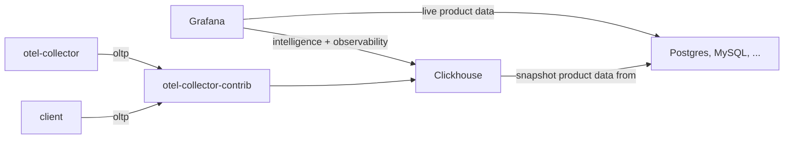

# cognative

cognative is an opinionated, minimalistic approach to business intelligence and operations.

**Goals**

1. Reduce the complexity and number of systems operations staff is required to have expertise on.
2. Maximizing the breadth of functionality they are able to support across BI and operations.
3. Simplify the experience for developers.
4. Enable companies to own their own data.
5. Be flexible enough to support a variety of deployment models.

## Background

I started cognativate as a recent reflection on the operation constraints faced by smaller organizations and how to make
the best use of their skills and expertise. Requiring operations staff to be experts on a large number of systems is not
sustainable and will only lead to burn out. And yet, an increasing number of complex systems need to be run to support
operations and business analytics.

The project name is a clever word play on words. It takes the acronym for the tech stack (COG) and joins it with 
"native". It came out of a discussion I had with [Tim Banks](https://github.com/timbanks) about the pitfalls of 
"traditional" operations tech stacks and how it's often short-sighted once you start to consider the broader needs of 
business intelligence. COG stands for **C**lickhouse, **O**penTelemetry, and **G**rafana. 

- [_Clickhouse_](#clickhouse) acts as our data warehousing layer storing logs, metrics, traces, as well as other
  business related data sets. Clickhouse comes with tons of integrations which makes it easy to source data from a
  variety of sources.
- [_OpenTelemetry_](#opentelemetry) provides instrumentation for our ecosystem. Information can be collected from a
  variety of sources using vendor neutral solutions. It also offers support across a large number of languages, making 
  it easy to add to any system today.
- [_Grafana_](#grafana) provides our data exploration, visualization, and alerting layer. It can easily be
  integrated with solutions like PagerDuty, OpsGenie, BetterStack, and much more.

### Scope of Work

[LGTM]: #lgtmp---loki-grafana-tempo-mimir--prometheus

Beyond proposing the initial proof of concept, my hope is to develop a lot of supporting resources to make this solution
as drop in as possible. Companies of varying sizes should be able to  Solutions like [LGTM][] benefit heavily from 
having many prebuilt resources (like dashboards and alerts) out of box. 

- Docker
  - [x] Initial proof of concept
- Examples
  - [ ] Clients emitting data
  - [ ] Stream processing pipelines
- Deployment
  - [ ] Docker
    - [x] local development
    - [ ] high availability
  - [ ] Helm
    - Repositories
      - `open-telemetry` - https://open-telemetry.github.io/opentelemetry-helm-charts
      - `grafana` - https://grafana.github.io/helm-charts
    - Charts
      - [ ] `cognative` - parent chart
      - [ ] `zookeeper` - maybe pull from bitnami for the time being?
      - [ ] `clickhouse` - maybe pull from bitnami for the time being?
      - [ ] `otel-collector` - pull from open-telemetry/opentelemetry-collector
      - [ ] `otel-collector-contrib` - can I reuse open-telemetry/opentelemetry-collector?
      - [ ] `grafana` - pull from grafana/grafana
- Monitoring
  - [ ] Dashboards & Alerting
    - [ ] JSONNET works, but is very dry... maybe a typescript library
    - [ ] Kubernetes monitoring mixin, but using clickhouse queries and grafana alerts

## Ecosystem

[//]: # (todo: this section really is just a collection of notes for now... I need to pull it together better)



[//]: # (COMMON BADGES)
[License - Apache 2.0]: https://img.shields.io/badge/license-Apache_2.0-blueviolet?style=for-the-badge
[License - AGPL 3.0]: https://img.shields.io/badge/license-AGPL_3.0-blueviolet?style=for-the-badge
[Host - On-prem]: https://img.shields.io/badge/host-on_prem-yellow?style=for-the-badge
[Host - Cloud]: https://img.shields.io/badge/host-cloud-yellow?style=for-the-badge
[Role - Storage]: https://img.shields.io/badge/role-storage-blue?style=for-the-badge
[Role - Instrumentation]: https://img.shields.io/badge/role-instrumentation-blue?style=for-the-badge
[Role - Visualization]: https://img.shields.io/badge/role-visualization-blue?style=for-the-badge
[Role - Alerting]: https://img.shields.io/badge/role-alerting-blue?style=for-the-badge

### Clickhouse

> ClickHouse is the fastest and most resource efficient open-source database for real-time apps and analytics.
> 
> https://clickhouse.com/

![License - Apache 2.0][]
![Role - Storage][]

![Host - On-prem][]
![Host - Cloud][]

- Easily import data from existing databases, object stores, queues, and many more [integrations](https://clickhouse.com/docs/en/integrations).
- Cloud option for those who don't want to run the system themselves.
- High availability requires deployment of a [Zookeeper ensemble](https://zookeeper.apache.org/doc/r3.1.2/zookeeperAdmin.html).
- Easily build data-enrichment pipelines using existing data in the system.

### OpenTelemetry

> OpenTelemetry is a collection of APIs, SDKs, and tools. Use it to instrument, generate, collect, and export telemetry
> data (metrics, logs, and traces) to help you analyze your software’s performance and behavior.
>
> https://opentelemetry.io/

![License - Apache 2.0][]
![Role - Instrumentation][]

![Host - On-prem][]

- Supports a large number of [languages](https://opentelemetry.io/docs/languages/).
- [Collectors](https://opentelemetry.io/docs/collector/) provide a vendor-agnostic way to receive, process, and export
  telemetry data.
- [Exporters](https://opentelemetry.io/docs/collector/configuration/#exporters) allow data to be sent to a variety of 
  backend destinations.
- [OTLP](https://opentelemetry.io/docs/specs/otlp/) provides a common and consistent way to collect metrics and traces 
  across languages.

### Grafana

> Query, visualize, alert on, and understand your data no matter where it’s stored. With Grafana you can create,
> explore, and share all of your data through beautiful, flexible dashboards.
> 
> https://grafana.com/oss/grafana/


![License - AGPL 3.0][]
![Role - Visualization][]
![Role - Alerting][]

![Host - On-prem][]
![Host - Cloud][]

- User-friendly query builders that allow non-technical staff to access information.
- Easily connects to popular relational databases with ease.
- Integrates nicely with Clickhouse, providing a single pane of glass to all your data.
- Unified alerting and notification channels makes it easy to get updated on what's happening with your product.
- Integrates with PagerDuty, BetterStack, and many others on-call solutions.
- Cloud hosted solution available for those who don't want to run the system themselves.

## Comparisons

[//]: # (todo: this section is mostly just a collection of notes and some rough ideas)

### ELK - ElasticSearch, LogStash, Kibana

The ELK stack is a long-standing solution for logs and metrics.

LogStash has a well-established history of being deployed as an ETL pipeline.

[//]: # (todo: add more content here...)


### LGTM/P - Loki, Grafana, Tempo, Mimir / Prometheus

The full Grafana stack requires a lot of operational experience. It effectively requires learning three new "databases"
for data that is largely the same. Loki is effectively a database for logs. Tempo, a database for traces. And finally, 
Mimir / Prometheus, a database for metrics. Each of these systems have their own resource usage and scaling requirements.

In addition, this is a partial solution as it does not cover the business intelligence side of the world. An additional
database can be added to support your business analytics, but doing so will only add to the complexity.

[//]: # (todo: add more content here...)


### XOG - ?, OpenTelemetry, Grafana

> Because OpenTelemetry is so flexible, why not pick one of the many other databases?

For a starter or simplified deployment, this is a great option. Leveraging an existing database technology may simplify
complexity today, it will pose some interesting technical challenges later on. Importing data from an existing database
technology into a solution like Clickhouse will be relatively easy.

[//]: # (todo: add more content here...)


## License

While no code currently exists in this repository, it seemed prudent to include a software license early on.

```
Copyright (C) 2024 The cognative authors
SPDX-License-Identifier: AGPL-3.0-only
```
