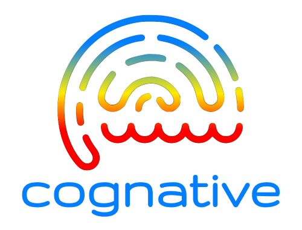

<div align="center">
<br/>



A modern approach to observability, operations, and business intelligence.
<br/>

[![Join the discussion!][]](https://github.com/mjpitz/cognative/discussions)
[![System architecture][]](docs/ARCHITECTURE.md)
[![Developers guide][]](docs/DEVELOPING.md)

[Documentation]: https://img.shields.io/badge/documentation-gray?style=for-the-badge
[Join the discussion!]: https://img.shields.io/badge/join_the_discussion!-yellow?style=for-the-badge
[System architecture]: https://img.shields.io/badge/system_architecture-027FFF?style=for-the-badge
[Developers guide]: https://img.shields.io/badge/developers_guide-FF0000?style=for-the-badge

</div>

## Background

Traditional approaches to observability, operations, and business intelligence treat these concerns as separate and
distinct. This often results in several, different technology stacks, often dramatically increasing the demand and
requirements of your on-call staff.

**Benefits**

- Access and analyze all your organizations business data, in a single location.
- Configure tiered storage once for all your logs, metrics, traces, and wide events.
- Reduced overhead for operators and developers alike, simplifying the testing process.

**Still not convinced?**

- Give Cognative a try by following one of our [Getting Started](docs/QUICKSTART.md) guides.
- See our documentation on [alternatives](docs/ALTERNATIVES.md) for more information.

## Technologies

Cognative is intended to provide a base layer that your company can build on top of. Want to add a queue before your
data hits the warehouse? Feel free to add which ever queuing technology your organization prefers. Cognative is a
[portmanteau][] that takes an acronym of the technologies involved (listed below) and the suffix "native" which means
"of indigenous origin or growth".

[portmanteau]: https://www.merriam-webster.com/dictionary/portmanteau

<table>
<tr>
<td width="120"></td>
<td>

[_Clickhouse_][clickhouse] is our data warehouse layer. It stores logs, metrics, traces, as well as other business
related data sets. Clickhouse also comes with tons of integrations which makes it easy to source data from a variety
of locations.

[clickhouse]: https://clickhouse.com/

</td>
</tr>
<tr>
<td></td>
<td>

[_OpenTelemetry_][open telemetry] provides instrumentation for our ecosystem. Information is collected from a variety
of sources using vendor neutral solutions. The community also supports a large number of languages, making it easy to
add to many systems today.

[open telemetry]: https://opentelemetry.io/

</td>
</tr>
<tr>
<td></td>
<td>

[_Grafana_][grafana] provides our data exploration, visualization, and alerting layer. It can easily integrate with
on-call solutions like PagerDuty, OpsGenie, BetterStack, and many more.

[grafana]: https://grafana.com/oss/grafana/

</td>
</tr>
</table>

## License

```text
Copyright (C) 2024 The cognative authors

This program is free software: you can redistribute it and/or modify
it under the terms of the GNU Affero General Public License as published by
the Free Software Foundation, either version 3 of the License, or
(at your option) any later version.

This program is distributed in the hope that it will be useful,
but WITHOUT ANY WARRANTY; without even the implied warranty of
MERCHANTABILITY or FITNESS FOR A PARTICULAR PURPOSE.  See the
GNU Affero General Public License for more details.

You should have received a copy of the GNU Affero General Public License
along with this program.  If not, see <http://www.gnu.org/licenses/>.
```
