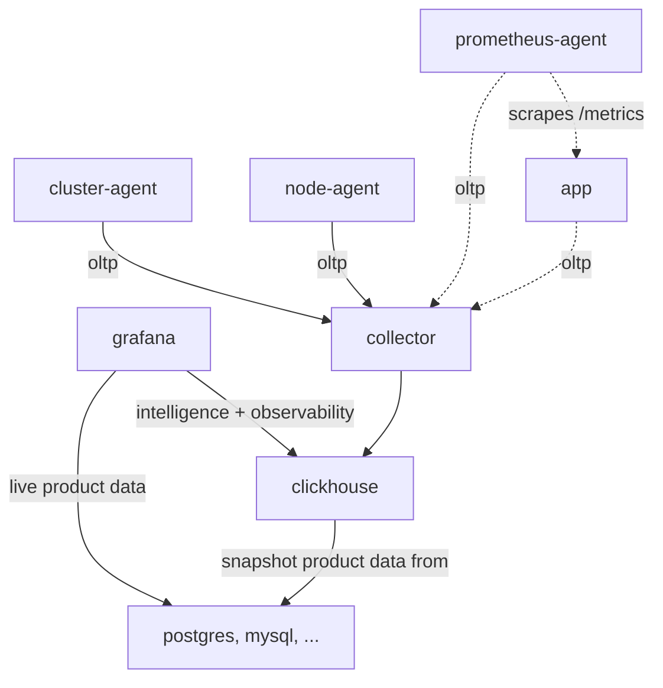
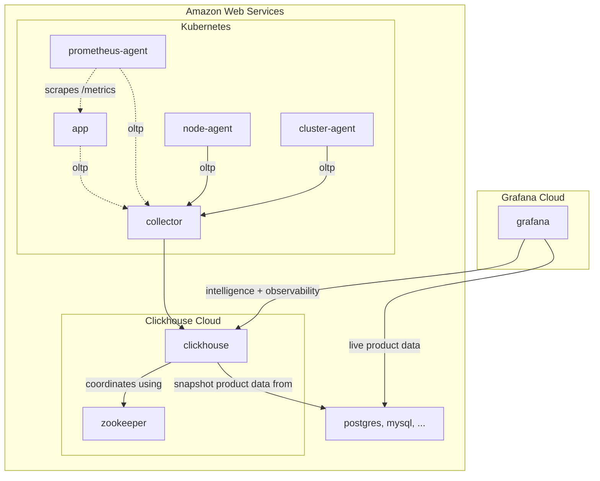

# Architecture

## Technologies

<!-- COMMON BADGES -->

[License - Apache 2.0]: https://img.shields.io/badge/license-Apache_2.0-blueviolet?style=for-the-badge
[License - AGPL 3.0]: https://img.shields.io/badge/license-AGPL_3.0-blueviolet?style=for-the-badge
[Host - On-prem]: https://img.shields.io/badge/host-on_prem-yellow?style=for-the-badge
[Host - Cloud]: https://img.shields.io/badge/host-cloud-yellow?style=for-the-badge
[Role - Storage]: https://img.shields.io/badge/role-storage-blue?style=for-the-badge
[Role - Instrumentation]: https://img.shields.io/badge/role-instrumentation-blue?style=for-the-badge
[Role - Visualization]: https://img.shields.io/badge/role-visualization-blue?style=for-the-badge
[Role - Alerting]: https://img.shields.io/badge/role-alerting-blue?style=for-the-badge

### Clickhouse

> ClickHouse is the fastest and most resource efficient open-source database for real-time apps and analytics.
>
> https://clickhouse.com/

![License - Apache 2.0][]
![Role - Storage][]

![Host - On-prem][]
![Host - Cloud][]

- System that's very reminiscent of one that I've used at a past [employer](https://www.youtube.com/watch?v=LBDZFtqL-ck).
- Easily import data from existing databases, object stores, queues, and many more [integrations](https://clickhouse.com/docs/en/integrations).
- Cloud option for those who don't want to run the system themselves.
- High availability requires deployment of a [Zookeeper ensemble](https://zookeeper.apache.org/doc/r3.1.2/zookeeperAdmin.html).
- Easily build data-enrichment pipelines using existing data in the system.

### OpenTelemetry

> OpenTelemetry is a collection of APIs, SDKs, and tools. Use it to instrument, generate, collect, and export telemetry
> data (metrics, logs, and traces) to help you analyze your software’s performance and behavior.
>
> https://opentelemetry.io/

![License - Apache 2.0][]
![Role - Instrumentation][]

![Host - On-prem][]

- Supports a large number of [languages](https://opentelemetry.io/docs/languages/).
- [Collectors](https://opentelemetry.io/docs/collector/) provide a vendor-agnostic way to receive, process, and export
  telemetry data.
- [Exporters](https://opentelemetry.io/docs/collector/configuration/#exporters) allow data to be sent to a variety of
  backend destinations.
- [OTLP](https://opentelemetry.io/docs/specs/otlp/) provides a common and consistent way to collect metrics and traces
  across languages.

### Grafana

> Query, visualize, alert on, and understand your data no matter where it’s stored. With Grafana you can create,
> explore, and share all of your data through beautiful, flexible dashboards.
>
> https://grafana.com/oss/grafana/

![License - AGPL 3.0][]
![Role - Visualization][]
![Role - Alerting][]

![Host - On-prem][]
![Host - Cloud][]

- User-friendly query builders that allow non-technical staff to access information.
- Easily connects to popular relational databases with ease.
- Integrates nicely with Clickhouse, providing a single pane of glass to all your data.
- Unified alerting and notification channels makes it easy to get updated on what's happening with your product.
- Integrates with PagerDuty, BetterStack, and many others on-call solutions.
- Cloud hosted solution available for those who don't want to run the system themselves.

## Deployment

This section illustrates a variety of hosted deployments. The [Self-hosted](#self-hosted) diagram is a great,
general-purpose illustration of how the components of the system work together.

### Self-hosted

This illustrates the high-level communication pattern between the various actors within the system. Since your company
will take on ownership running the various components, it's entirely up to you how this subsystem is deployed.

### Cloud-hosted

For those who prefer cloud-hosted solutions, both Grafana and Clickhouse offer a cloud-hosted version of their system.
Clickhouse will spin up and manage a cluster inside your AWS account for you. Grafana will host an instance on their
side of the world so you don't need to worry about the minutia of operating the complexity of that alerting stack. The
challenge will always come down to connecting those two clouds to enable communication.

